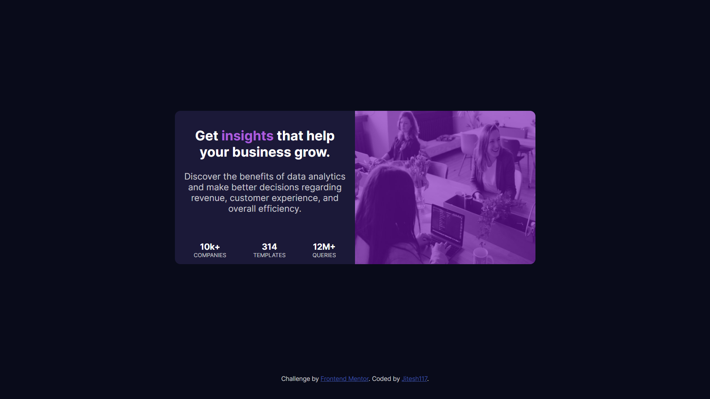

# Frontend Mentor - Stats preview card component solution

This is a solution to the [Stats preview card component challenge on Frontend Mentor](https://www.frontendmentor.io/challenges/stats-preview-card-component-8JqbgoU62). Frontend Mentor challenges help you improve your coding skills by building realistic projects. 

## Table of contents

- [Overview](#overview)
  - [The challenge](#the-challenge)
  - [Screenshot](#screenshot)
  - [Links](#links)
- [My process](#my-process)
  - [Built with](#built-with)
  - [What I learned](#what-i-learned)
  <!-- - [Continued development](#continued-development) -->
  <!-- - [Useful resources](#useful-resources) -->
- [Author](#author)
<!-- - [Acknowledgments](#acknowledgments) -->

## Overview

### The challenge

Users should be able to:

- View the optimal layout depending on their device's screen size

### Screenshot

**Note: Delete this note and the paragraphs above when you add your screenshot. If you prefer not to add a screenshot, feel free to remove this entire section.**

### Links

- [Solution URL](https://www.frontendmentor.io/solutions/statspreviewresponsivesolution-VkulT68Ae)
-  [Live Site URL](https://stats-preview-frontend-mentor-pnrowkgt5-jitesh117.vercel.app/)

## My process

### Built with

- Semantic HTML5 markup
- CSS custom properties
- Flexbox
- Mobile-first workflow
**Note: These are just examples. Delete this note and replace the list above with your own choices**

### What I learned

In this challenge i learned how to make colored overlay on images

## Author
- Frontend Mentor - [@Jitesh117](https://www.frontendmentor.io/profile/Jitesh117)
- Twitter - [@Jitesh_117](https://www.twitter.com/jitesh117)

